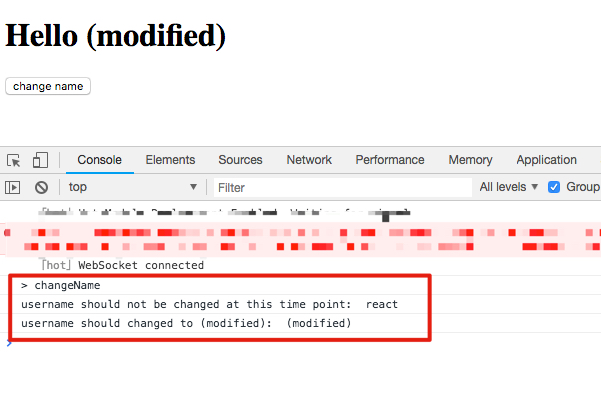

JavaScript React "setState" Order Check Demo
============================================

React中的`setState()`是推迟执行的，这就意味着，如果它之后的代码使用`this.state`，得到的将会是更新前的数据。

好在`setState`里还有一个参数，可以传一个function，将会在state改变之后执行，在那里可以拿到修改后的数据。

```
npm install
npm run dev
```


